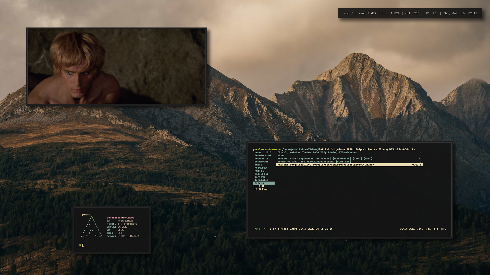

# dotfiles

My \*nix config files

## Setup

- Distro: `arch linux`
- WM: `2bwm`
- Compositor: `picom`
- Terminal emulator: `alacritty`
- Editor: `neovim`
- Shell: `zsh`
- Notifications: `dunst`
- Application manager: `rofi`
